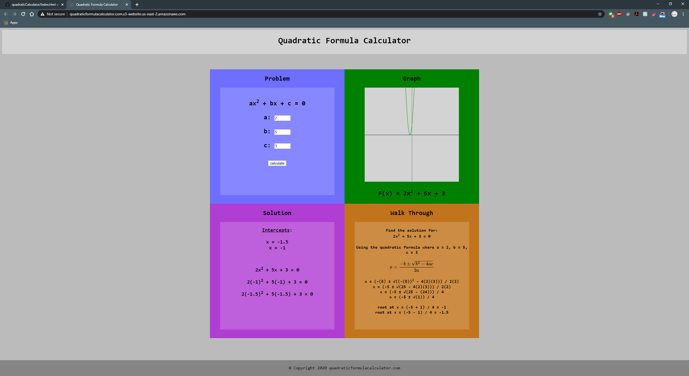

# Quadratic Formula Calculator Website
A simple website that allows the user to find the roots of quadratics.

# Here is how it works
1. Enter a number in the a, b, and c text fields.
2. Press the calculate button.
3. The intercepts will be calculated and displayed, as well as the steps taken to obtain them.

# How to access it
Click <a href="http://www.quadraticformulacalculator.s3-website.us-east-2.amazonaws.com">here</a> to visit the website.

# Author
<a href="https://github.com/btror">Brandon</a>
